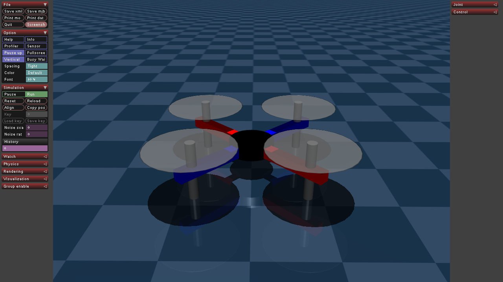
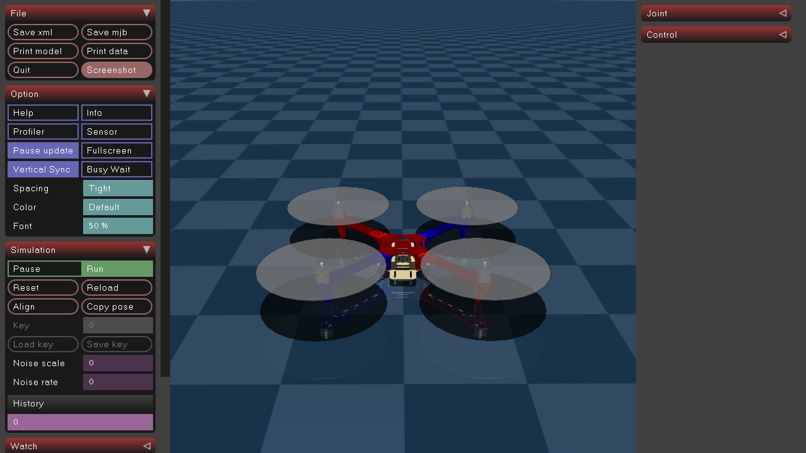

# A Collection of MuJoCo Models

## How to Use

1. Clone the Repository
    ```bash
    git clone https://github.com/drmwnrafi/mujoco_model.git
    ```
2. Create a Python Virtual Environment
    ```bash
    python -m venv mujoco_models
    source mujoco_models/bin/activate  # For Windows: mujoco_models\Scripts\activate
    ```
3. Install Dependencies
    ```bash
    pip install -r requirements.txt
    ```
4.  Run the Simulation
    - Navigate to the project directory
        ```bash
        cd mujoco_model
        ```
    - Execute the simulation 
        ```bash
        python f450_geom_cntrl.py
        ```

## Model Previews
| **Model**            | **Preview**                                     |
|-----------------------|------------------------------------------------|
| **Simple Quadcopter** |  |
| **F450 Quadcopter**   |            |
