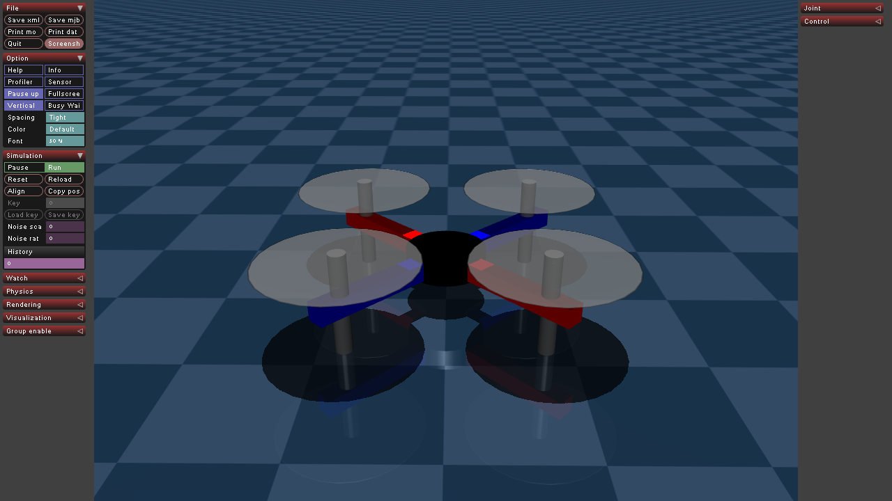
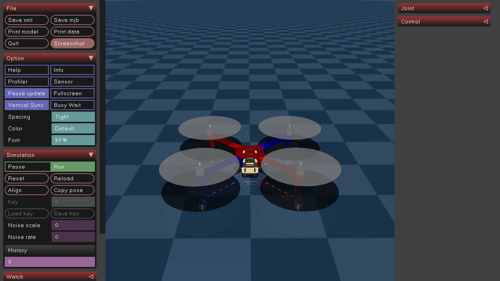
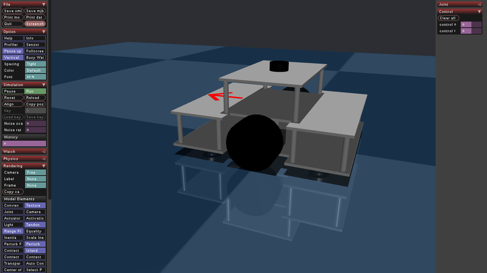
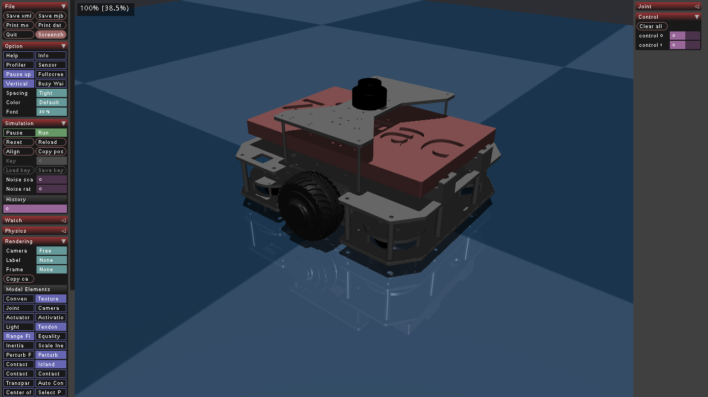

# A Collection of MuJoCo Models

This repository is my journey of learning MuJoCo. It also includes the application of Geometric Control for a quadcopter and Levenberg-Marquardt Point-to-Line ICP for mobile robot mapping. 

## Model Previews
| **Model**            | **Preview**                                     |
|-----------------------|------------------------------------------------|
| **Low Quality F450 Quadcopter** |  |
| **High Quality F450 Quadcopter**   |            |
| **Low Quality Mobile Robot** |  |
| **High Quality Mobile Robot** <br> ( Motor currently not working )   |            |

## How to Use

1. Clone the Repository
    ```bash
    git clone https://github.com/drmwnrafi/mujoco_zoo.git
    ```
2. Create a Python Virtual Environment
    ```bash
    python -m venv mj_zoo
    # For Linux: 
    source mj_zoo/bin/activate  
    # For Windows: 
    mj_zoo\Scripts\activate
    ```
3. Install Dependencies
    ```bash
    cd mujoco_zoo
    pip install -r requirements.txt
    ```
4.  Run the Mujoco GLFW Simulation
    ```bash
    python mjzoo/src/mobile_robot/main.py 
    # or
    python mjzoo/src/quadcopter/main.py 
    ```
    
Run the Mujoco Tkinter GUI (Optional)
    ```bash
    python mjzoo/src/mobile_robot/main_tkinter.py
    ```

<div align="center">
  <a href="https://www.youtube.com/watch?v=9HrDTDOXUvg" target="_blank">
    
  </a>
</div>